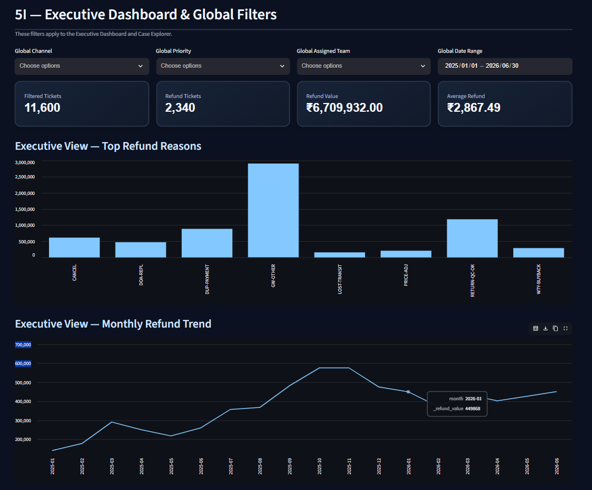
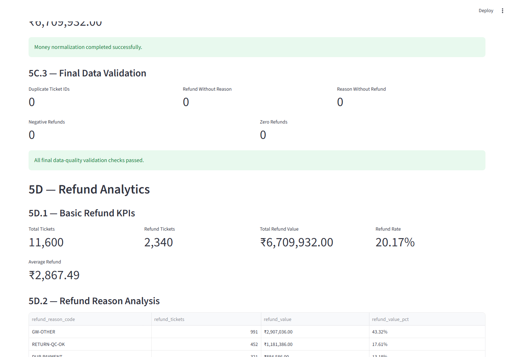
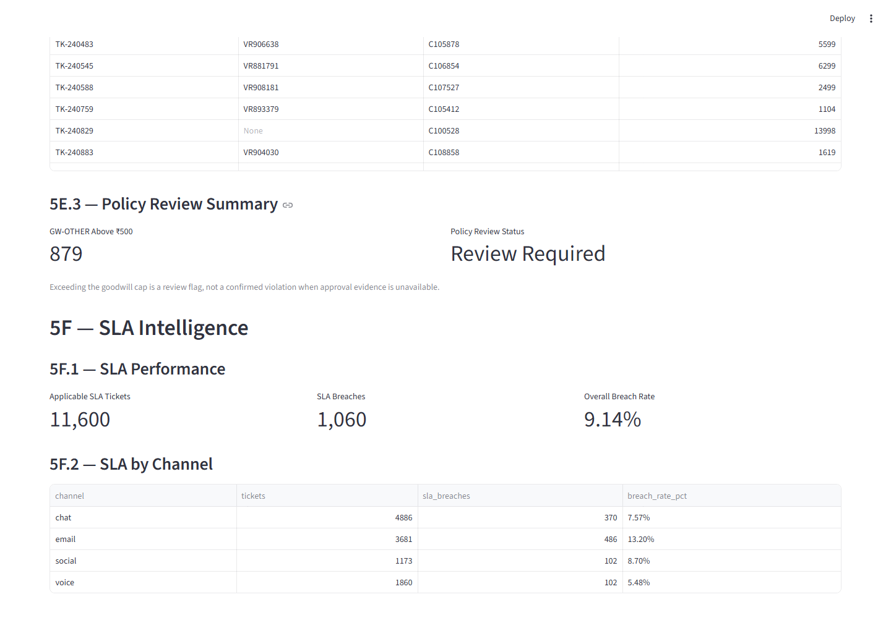
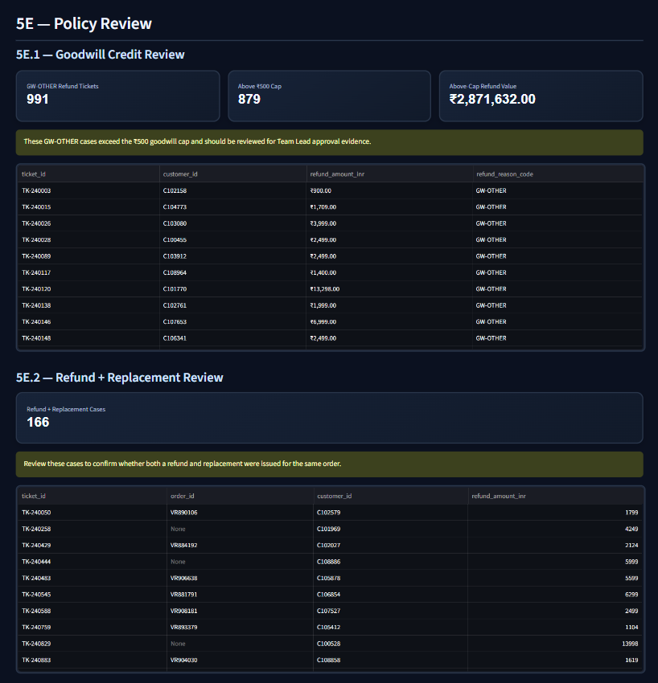
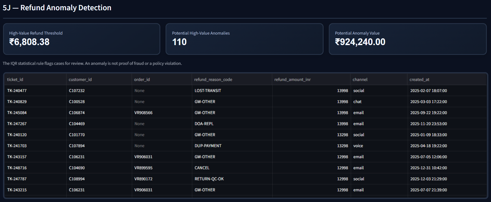
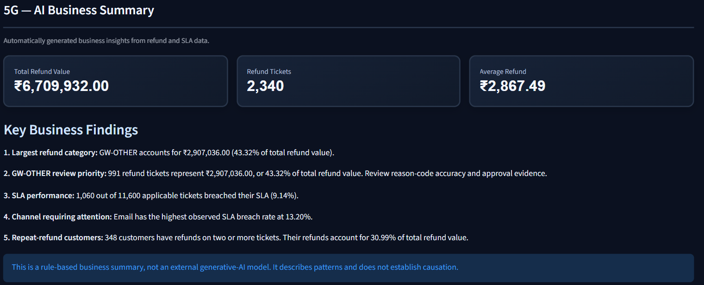
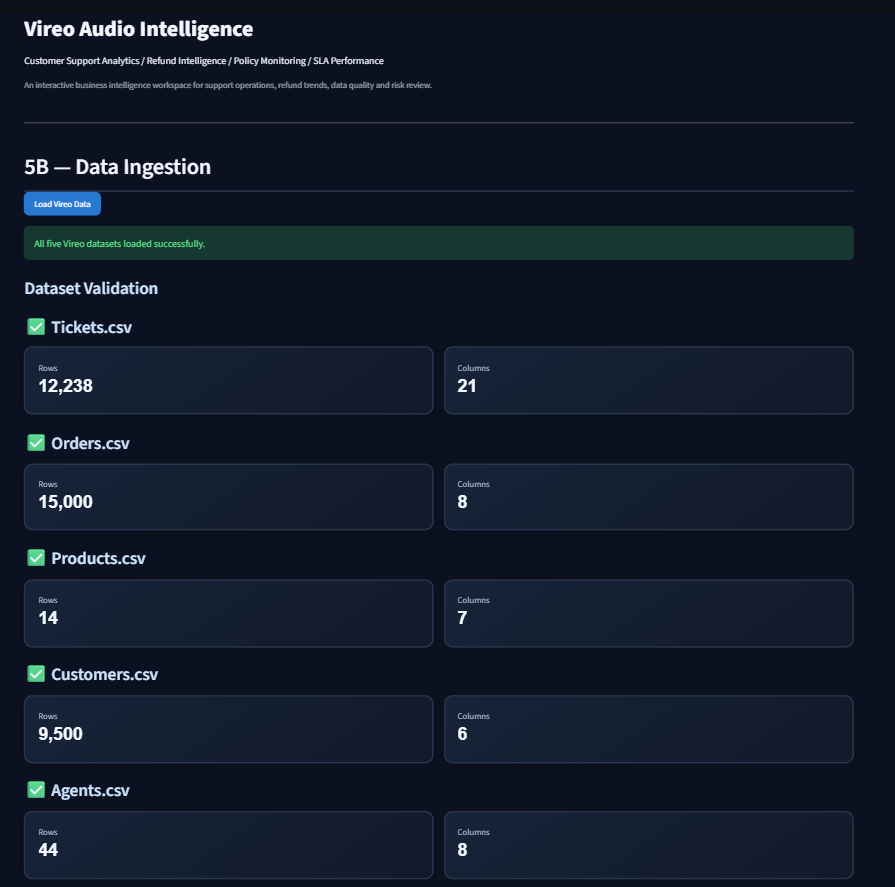
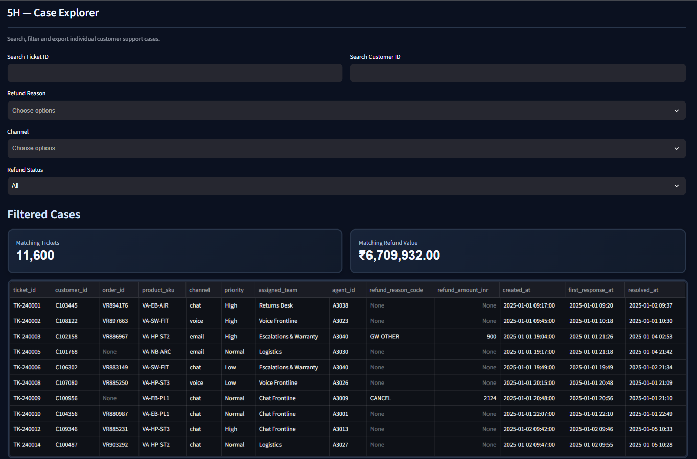

# Vireo Audio Customer Support & Refund Intelligence

**A data-driven customer support analytics dashboard for refund intelligence, policy compliance, SLA monitoring, and business insights.**

[](https://www.python.org/)
[](https://streamlit.io/)
[](https://pandas.pydata.org/)
[](https://numpy.org/)

---

## Overview

Vireo Audio Customer Support & Refund Intelligence is a **Streamlit-based analytics application** designed to turn customer support, order, product, customer, and refund data into actionable operational insights.

The dashboard brings multiple analytical workflows into one place, helping users investigate refund patterns, review policy-related cases, monitor service-level agreement (SLA) performance, identify potentially unusual refund amounts, and explore individual support tickets.

The project demonstrates practical skills in **Python, data cleaning, exploratory data analysis, business intelligence, rule-based analytics, anomaly detection, and interactive dashboard development**.

## Dashboard Preview

<!-- Add screenshots to the screenshots/ folder using the filenames below. -->

### Executive Dashboard



### Refund Analytics



### SLA Intelligence



### Policy Review



### Refund Anomaly Detection



### AI Business Summary



### Data Ingestion & Validation



### Case Explorer



---

## Key Features

### 1. Data Ingestion & Validation
- Load and inspect the project's customer support and business datasets.
- Validate data availability and examine data quality.
- Review ingestion and validation results before using the data for analysis.

### 2. Data Cleaning & Reconciliation
- Prepare data for downstream analysis.
- Support consistency checks across relevant datasets.
- Organize customer, order, product, and ticket information for integrated reporting.

### 3. Executive Dashboard & Global Filters
- View high-level customer support and refund performance indicators.
- Explore business metrics through interactive filters.
- Analyze ticket and refund patterns from an executive reporting perspective.

### 4. Refund Analytics
- Analyze refund ticket volumes and refund values.
- Review average refund amounts and refund-related patterns.
- Identify product or refund categories contributing to the observed workload.
- Support data-driven investigation of refund operations.

### 5. Policy Review
- Review refund-related cases against configured business policy rules.
- Identify cases that may require further review.
- Help prioritize potentially policy-related exceptions for human investigation.

### 6. SLA Intelligence
- Evaluate support response performance against configured channel-specific SLA targets.
- Compare SLA performance across communication channels.
- Identify breached or potentially at-risk service cases.

**Configured SLA targets**

| Channel | Target |
|---|---:|
| Chat | 15 minutes |
| Voice | 120 minutes |
| Social | 240 minutes |
| Email | 480 minutes |

These are the targets configured for this project, not universal industry standards.

### 7. Refund Anomaly Detection
- Apply an Interquartile Range (IQR)-based statistical method to flag unusually high refund amounts.
- Highlight potential anomalies for further investigation.
- Help analysts prioritize unusual transactions without automatically treating them as fraud.

**Important:** A statistical anomaly is an investigation signal, not proof of fraudulent activity or policy violation.

### 8. AI Business Summary
- Generate a concise business-oriented summary from available dashboard metrics and analytical findings.
- Surface important trends and areas that may need attention.
- Use rule-based logic to translate analytical results into readable insights.

**Implementation note:** The current business summary is rule-based; it should not be interpreted as evidence of an external generative AI or LLM integration.

### 9. Case Explorer
- Search and inspect individual support cases.
- Use available filters to narrow down relevant records.
- Export filtered case data to CSV for additional analysis.

### 10. Data Quality & Reporting
- Review data-quality indicators.
- Use dashboard findings to support operational investigation and reporting.
- Export relevant analytical results where supported by the application.

---

## Project Insights

The current dataset produced the following dashboard results:

| Metric | Observed Result |
|---|---:|
| Total support tickets | 11,600 |
| Refund tickets | 2,340 |
| Total refund value | ₹67,09,932 |
| Average refund amount | ₹2,867.49 |
| GW-OTHER share of refund tickets | 43.32% |
| SLA breach rate | 9.14% |
| Email SLA breach rate | 13.20% |
| Customers with repeat-refund activity | 348 |

These figures describe the dataset currently analyzed by the application. They are not independently verified company-wide performance figures.

The dashboard also flags potentially unusual refund amounts using its configured IQR-based approach. Flagged cases should be reviewed alongside relevant order details, customer history, and policy rules.

---

## Technology Stack

| Technology | Purpose |
|---|---|
| Python | Application logic and analytical workflows |
| Streamlit | Interactive web dashboard |
| Pandas | Data loading, cleaning, transformation, and analysis |
| NumPy | Numerical and statistical operations |
| Git & GitHub | Version control and project hosting |

---

## Project Structure

```text
vireo-support-intelligence/
├── app.py
├── requirements.txt
├── README.md
├── src/
│   ├── analytics.py
│   ├── cleaning.py
│   └── data_loader.py
├── data/
│   ├── agents.csv
│   ├── customers.csv
│   ├── orders.csv
│   ├── products.csv
│   └── tickets.csv
└── screenshots/
    ├── executive-dashboard.png
    ├── refund-analytics.png
    ├── sla-intelligence.png
    ├── policy-review.png
    ├── anomaly-detection.png
    ├── ai-business-summary.png
    ├── data-ingestion.png
    └── case-explorer.png
```

*The `screenshots/` directory is for README preview images. Add the screenshots yourself using the filenames above. Local data files may be excluded from version control.*

---

## Getting Started

### Prerequisites

- Python 3.10 or a compatible version
- pip
- Git

### 1. Clone the repository

```bash
git clone https://github.com/Syed-SS/vireo-support-intelligence.git
cd vireo-support-intelligence
```

### 2. Create a virtual environment

**Windows PowerShell**

```powershell
python -m venv .venv
.\.venv\Scripts\Activate.ps1
```

**macOS / Linux**

```bash
python3 -m venv .venv
source .venv/bin/activate
```

### 3. Install dependencies

```bash
python -m pip install --upgrade pip
pip install -r requirements.txt
```

### 4. Prepare the data

Ensure the required CSV files are available in the expected local `data/` directory, or use the data-loading method configured in the application.

Do not commit confidential, personally identifiable, or otherwise sensitive customer data to a public repository. Use synthetic, anonymized, or appropriately authorized data when sharing the project.

### 5. Run the application

```bash
streamlit run app.py
```

Streamlit will display a local URL in the terminal, typically:

```text
http://localhost:8501
```

Open that address in your browser to explore the dashboard.

---

## Analytical Approach

The project brings together several practical analytics techniques:

- **Data preparation:** validation, cleaning, and reconciliation of relevant records.
- **Descriptive analytics:** refund totals, ticket volumes, averages, and category-level patterns.
- **SLA analysis:** comparison of observed response performance with configured targets.
- **Policy-oriented review:** rule-based identification of cases requiring additional attention.
- **Statistical anomaly detection:** IQR-based identification of unusually high refund values.
- **Business reporting:** conversion of analytical outputs into dashboard indicators and readable summaries.

Results depend on the input data, configured rules, and implementation assumptions. An alert should be treated as a prompt for investigation rather than an automatic final decision.

## Limitations & Responsible Use

- The reported metrics reflect the currently analyzed dataset.
- SLA results depend on the available timestamps, channel definitions, and configured targets.
- Policy review is limited to the rules implemented in the application.
- IQR-based anomaly detection identifies statistical outliers; it does not establish fraud.
- The business summary is rule-based and should not be described as an LLM-powered feature.
- Customer-level analysis should be performed only with appropriate data access and privacy safeguards.

## Future Improvements

Potential extensions include:

- Automated data refresh and scheduled reporting.
- More detailed SLA trend analysis.
- Configurable refund-policy rules.
- Improved anomaly detection and explainability.
- Additional downloadable reports.
- Automated testing and deployment.
- Role-based access controls for sensitive operational data.

## Skills Demonstrated

`Python` · `Streamlit` · `Pandas` · `NumPy` · `Data Cleaning` · `Exploratory Data Analysis` · `Business Intelligence` · `KPI Reporting` · `SLA Monitoring` · `Refund Analytics` · `Statistical Anomaly Detection` · `Data Visualization`

## Author

**Syed Shahed**

- GitHub: [Syed-SS](https://github.com/Syed-SS)
- LinkedIn: [syedshahed-ai](https://www.linkedin.com/in/syedshahed-ai)

---

*Built as a practical customer support analytics and refund intelligence project using Python and Streamlit.*
on](screenshots/anomaly-detection.png)
